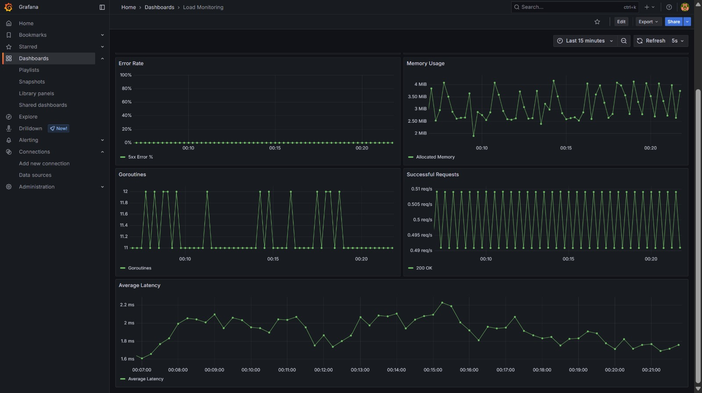
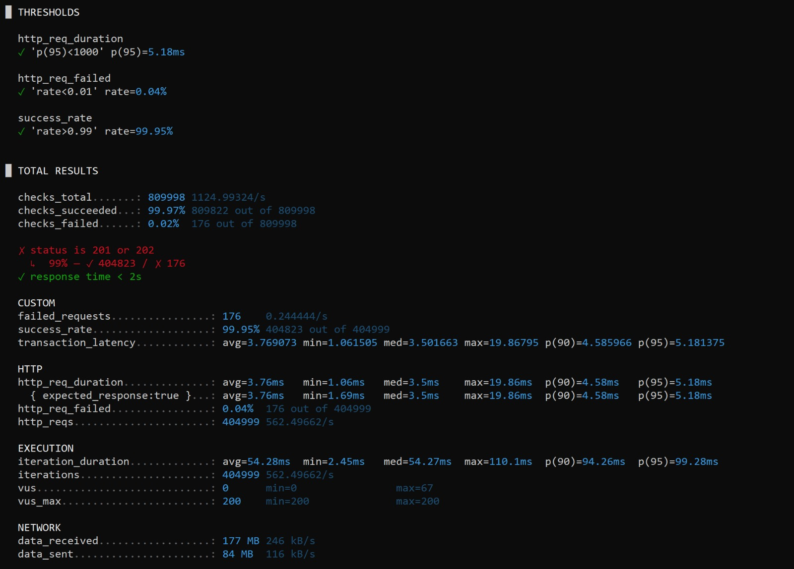

# Banking Peak Load Management Prototype

[](https://github.com/ahargunyllib/banking-peak-load-prototype/actions/workflows/ci.yaml)

A university prototype demonstrating defense-in-depth scalability for banking peak load — simulating CIMB Niaga's problem of 1M transactions/hour causing crashes, 10s latency, and cost spikes.

## Problem Statement

A major bank experiences system crashes during peak load. Root causes: no load shedding or backpressure, database connection exhaustion, heavy queries without caching, and reactive (not proactive) scaling. This prototype shows how layered protection mechanisms bring the system from >20% error rate and >5s p95 latency down to <0.5% errors and <2s p95 write latency.

## Architecture

Defense-in-depth: four protection layers between client and database. Each layer reduces load on the layer below it.

```
Client
  │
  ▼
┌──────────────────────────┐
│  Layer 1: Rate Limiter   │  Token bucket per client IP
│  (middleware)            │  Reject early → HTTP 429
└────────────┬─────────────┘
             │
             ▼
┌──────────────────────────┐
│  Layer 2: Circuit Breaker│  Monitor downstream health
│  (middleware)            │  Fail-fast → HTTP 503
└────────┬─────────┬───────┘
         │         │
       READ      WRITE
         │         │
         ▼         ▼
┌────────────┐ ┌──────────┐
│ Layer 3a:  │ │Layer 3b: │
│ Redis Cache│ │  Queue   │
│ (cache-    │ │(producer)│
│  aside)    │ │          │
└─────┬──────┘ └────┬─────┘
      │              │
      ▼              ▼
┌──────────┐  ┌────────────┐
│ Read     │  │  Worker    │
│ Replica  │  │ (consumer) │
└─────┬────┘  └─────┬──────┘
      │              │
      ▼              ▼
┌──────────────────────────┐
│  Layer 4: PostgreSQL     │
│  (via PgBouncer)         │
│  Primary: writes only    │
│  Replica: reads only     │
└──────────────────────────┘
```

**Read path:** Rate limit → Circuit breaker → Redis cache lookup → (miss) Read replica via PgBouncer → cache + return

**Write path (optimized):** Rate limit → Circuit breaker → Validate → Publish to queue → HTTP 202. Worker: check balance → debit/credit → commit → invalidate cache

**Write path (baseline):** Synchronous DB transaction → HTTP 201

## Tech Stack

| Component | Technology |
|-----------|-----------|
| Language | Go 1.25 |
| HTTP Router | Echo |
| Database | PostgreSQL 16 + PgBouncer (transaction pooling) |
| Cache | Redis 7 |
| Message Queue | RabbitMQ |
| Observability | Prometheus + Grafana |
| Load Testing | k6 |
| Infrastructure | Docker Compose |
| Optional Orchestration | Kubernetes manifests (`deployments/k8s/`) |
| CI | GitHub Actions |
| Dev tooling | air (live reload), golangci-lint, Nix flake |

## API Endpoints

| Method | Path | Description |
|--------|------|-------------|
| `POST` | `/api/v1/transactions` | Create transaction (async via queue when enabled) |
| `GET` | `/api/v1/transactions/:id/status` | Transaction status inquiry |
| `GET` | `/api/v1/accounts/:id/balance` | Account balance inquiry |

## Feature Flags

All protection/optimization layers are toggled via environment variables. Baseline = all off. Optimized = all on.

| Variable | Default | Description |
|----------|---------|-------------|
| `CACHE_ENABLED` | `false` | Redis cache for read path |
| `QUEUE_ENABLED` | `false` | Async write via message queue |
| `RATE_LIMIT_ENABLED` | `false` | Token bucket rate limiting |
| `CIRCUIT_BREAKER_ENABLED` | `false` | Fail-fast on unhealthy downstream |
| `DB_READ_REPLICA_ENABLED` | `false` | Route reads to replica |

See [Development Guide](docs/development.md) for the full environment variable reference.

## Quick Start

**Prerequisites:** Go 1.25, Docker & Docker Compose v2, k6, Make

```bash
# Install Go tooling
make init

# --- Baseline (API + PostgreSQL only) ---
cp .env.baseline.example .env
docker compose up -d
k6 run scripts/load-test/baseline.js

# --- Optimized (+ Redis, RabbitMQ, read replica) ---
cp .env.optimized.example .env
docker compose --profile optimized up -d
k6 run scripts/load-test/optimized.js

# --- Full stack (+ Prometheus, Grafana) ---
docker compose --profile optimized --profile observability up -d
# Grafana: http://localhost:3000
# Prometheus: http://localhost:9090
```

Seed dummy data (100K accounts, 1M transactions):

```bash
make seed
```

## Makefile Commands

| Command | Description |
|---------|-------------|
| `make init` | Download Go modules and install dev tools (air, golangci-lint) |
| `make dev` | Start server with live reload (air) |
| `make lint` | Run golangci-lint |
| `make test` | Run unit tests (`go test -v ./...`) |
| `make build` | Compile binary to `bin/app` |
| `make seed` | Seed 100K accounts + 1M transactions |

## Docker Compose Profiles

| Command | Services |
|---------|----------|
| `docker compose up` | API + PostgreSQL (baseline) |
| `docker compose --profile optimized up` | + Redis, RabbitMQ, read replica |
| `docker compose --profile observability up` | + Prometheus, Grafana |
| `docker compose --profile optimized --profile observability up` | Full stack |

## Kubernetes Manifests

Experimental Kubernetes manifests are included under `deployments/k8s/` for demonstrating the same prototype stack in a cluster. They cover the app, PostgreSQL, PgBouncer, Redis, RabbitMQ, Prometheus, Grafana, ConfigMap/Secret, namespace, and HPA resources.

Review image names, secrets, and environment variables before applying them to a cluster:

```bash
kubectl apply -f deployments/k8s/namespace.yaml
kubectl apply -f deployments/k8s/
```

## SLO Targets

| Metric | Baseline | Optimized |
|--------|----------|-----------|
| p95 Latency (read) | > 2s | < 500ms |
| p95 Latency (write) | > 5s | < 2s |
| Error Rate at peak | > 20% | < 0.5% |
| Max TPS | < 100 | > 300 |
| Cache Hit Rate | N/A | > 80% |
| Availability | — | 99.5% non-5xx |

## Load Test Evidence

The PR also includes captured screenshots for the optimized demonstration run.

Grafana dashboard:



k6 load test:



## Project Structure

```
banking-peak-load-prototype/
├── cmd/server/main.go         # Entry point
├── internal/
│   ├── config/                # Env-based configuration
│   ├── handler/               # HTTP handlers
│   ├── middleware/            # Rate limiter, circuit breaker, logging, tracing
│   ├── repository/            # DB access + cache-aside logic
│   ├── service/               # Business logic
│   ├── queue/                 # Queue producer + worker consumer
│   └── model/                 # Domain types
├── migrations/                # SQL migrations
├── seeds/                     # Dummy data generation
├── scripts/
│   ├── load-test/             # k6 scripts (baseline.js, optimized.js)
│   └── setup/                 # Helper scripts (seed, wait-for-db)
├── deployments/
│   ├── docker/                # Dockerfiles
│   ├── pgbouncer/             # PgBouncer config
│   ├── prometheus/            # prometheus.yml
│   └── grafana/               # Dashboard JSON provisioning
├── docs/                      # All documentation
├── Makefile
└── docker-compose.yml
```

## Documentation

| Document | Description |
|----------|-------------|
| [PRD](docs/prd.md) | Problem statement, requirements, success criteria, milestones |
| [Architecture](docs/architecture.md) | System design, read/write paths, cache TTLs, DB schema, metrics |
| [Development Guide](docs/development.md) | Setup, env vars, coding conventions, testing |
| [Workflow](docs/workflow.md) | Git branching, commit conventions, PR checklist |
| [ADR-001](docs/adrs/001-go-over-rust.md) | Go over Rust for language choice |
| [ADR-002](docs/adrs/002-feature-flag-over-branches.md) | Feature flags over branches for comparison |
| [ADR-003](docs/adrs/003-pgbouncer-connection-pooling.md) | PgBouncer for connection pooling |
| [ADR-004](docs/adrs/004-redis-caching-strategy.md) | Cache-aside pattern with Redis |
| [ADR-005](docs/adrs/005-async-write-via-queue.md) | Async writes via message queue |

## Testing

```bash
# Unit tests
go test ./...

# Integration tests (requires docker compose up)
go test -tags=integration ./...

# Load tests
k6 run scripts/load-test/baseline.js
k6 run scripts/load-test/optimized.js
```
